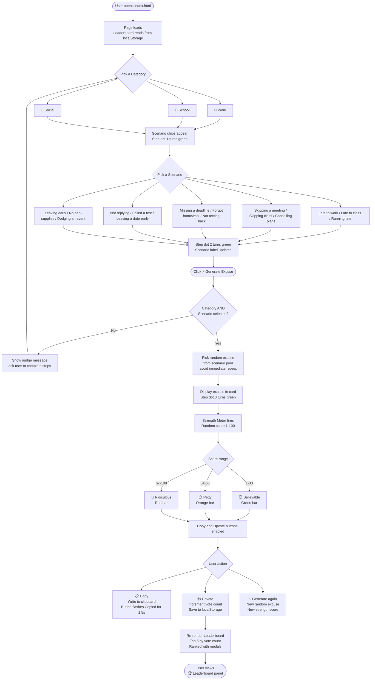
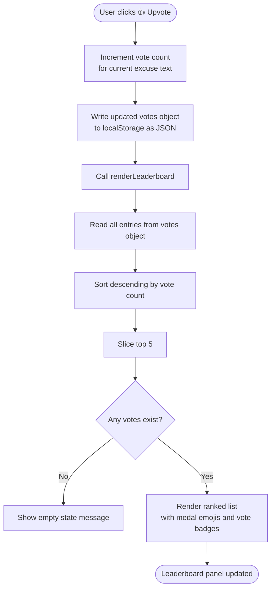
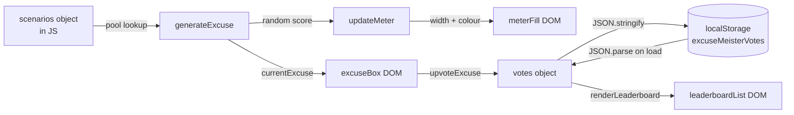

# 🗺️ Excuse-Meister — App Flowchart

Full interactive flow of the Excuse-Meister application.

---

## Main App Flow

---

## Leaderboard Sub-Flow

---

## Data Flow

---

*See [`README.md`](README.md) for project overview · [`USER_GUIDE.md`](USER_GUIDE.md) for usage instructions.*
